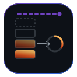

<div align="center">



# cindervm

**A deterministic bytecode VM for agent execution.**
Verified bytecode, serializable continuations, exact replay.

[](https://github.com/ashish/cindervm/actions/workflows/ci.yml)
[](https://crates.io/crates/cindervm)
[](https://docs.rs/cindervm)
[](rust-toolchain.toml)
[](docs/isa.md)
[](Cargo.toml)
[](src/lib.rs)
[](#license)



<sub>`cinderc` → `verify` → `run` → `replay --seek`. Full transcript in [docs/walkthrough.md](docs/walkthrough.md).</sub>

</div>

---

## Contents

- [What this is](#what-this-is)
- [Why a VM](#why-a-vm)
- [Mental model](#mental-model)
- [Quickstart](#quickstart)
- [The instruction set](#the-instruction-set)
- [The verifier](#the-verifier)
- [Continuations](#continuations)
- [Determinism and replay](#determinism-and-replay)
- [The supervisor](#the-supervisor)
- [Performance](#performance)
- [Building from source](#building-from-source)
- [Repository layout](#repository-layout)
- [Stability](#stability)
- [FAQ](#faq)
- [License](#license)

---

## What this is

An agent run is a long-lived, effectful, resumable computation. Most frameworks
model it as a Python `while` loop with a list of dicts, which means the run's
state lives in interpreter frames you cannot serialize, on a machine you cannot
lose, in an order you cannot reproduce.

`cindervm` models it as **bytecode on a machine designed for it**. Agent
control flow — issuing a tool call, awaiting it, forking speculative branches,
checkpointing, yielding to a scheduler — is expressed in the instruction set
rather than in host-language coroutines. Consequences follow from that one
decision:

| Property | Mechanism |
|---|---|
| A run can be moved between hosts mid-flight | The entire machine state is a value ([`cont.rs`](src/cont.rs)) |
| A crashed run resumes without re-executing effects | Append-only, hash-chained journal ([`journal.rs`](src/journal.rs)) |
| A bug is reproducible from the log alone | The interpreter is a pure function of `(image, journal)` |
| Malformed bytecode cannot corrupt the interpreter | Bytecode is verified before it is admitted ([`verify.rs`](src/verify.rs)) |
| Cost is bounded before a token is spent | Budget reservations are instructions, not middleware |

## Why a VM

The alternative designs and why they were rejected:

**Host coroutines** (`async fn`, Python `async def`). Suspension points are
implicit and the suspended state is a compiler-generated struct with no stable
representation. You cannot write it to disk, you cannot inspect it, and you
cannot resume it in a different process. Fine for I/O concurrency; wrong for
durable execution.

**Durable-execution engines with replay-based recovery.** Recovery works by
re-running the whole program and short-circuiting completed calls from a log.
This makes non-determinism catastrophic: one unlogged `now()` and the replay
diverges from the original. `cindervm` restores state directly instead of
re-deriving it, so divergence is impossible by construction — and every source
of non-determinism is an instruction that reads from the journal.

**Interpreting a graph / AST.** Workable, but the state is a tree of live
objects with sharing and cycles, so serialization becomes a graph-walk with
identity preservation. A flat operand stack over a flat heap of tagged values
serializes as a memcpy of two arrays plus a relocation pass.

The VM approach costs an assembler and a verifier. It buys a state
representation that is *already* a byte string.

---

## Mental model

```
                        ┌──────────────────────────────────────────┐
   .cdx source          │  cinderc                                 │
  ───────────────────►  │   lex ─► parse ─► resolve ─► encode      │
                        │                       │                  │
                        └───────────────────────┼──────────────────┘
                                                ▼
                                        image.cdxb  (verified once,
                                                     hash-sealed)
                                                │
        ┌───────────────────────────────────────┴───────────────────┐
        ▼                                                           ▼
┌───────────────────┐                                    ┌────────────────────┐
│  interp.rs        │   trap(CALL_TOOL, args)            │  supervisor (Go)   │
│                   │ ─────────────────────────────────► │                    │
│  pc, stack, heap  │                                    │  scheduler         │
│  frames, budget   │ ◄───────────────────────────────── │  syscall broker    │
│                   │   journal record #n (sealed)       │  quota ledger      │
└─────────┬─────────┘                                    └────────────────────┘
          │
          │  YIELD_CTX / CHECKPOINT
          ▼
┌───────────────────┐
│  cont.rs          │   snapshot ──► blob ──► object store
│  frozen machine   │   blob ──────► restore  (any host, any time)
└───────────────────┘
```

Three invariants hold everywhere in the codebase, and most of the design falls
out of them:

1. **The interpreter performs no I/O.** It returns a `Trap` describing what it
   needs. The host answers. This is why replay is exact — replacing the host
   with a journal reader is a no-op from the interpreter's perspective.
2. **Every value is copyable and tagged.** No host pointers in VM state, no
   `Rc`, no interior mutability. `Value` is `Copy` and 16 bytes; anything larger
   lives in the heap arena behind a `Handle`.
3. **Verification is a precondition of execution, not a mode.** `Image` cannot
   be constructed except through `verify::admit`. The interpreter therefore
   contains no bounds checks on `pc`, no stack-depth checks, and no operand type
   dispatch failures — the verifier already proved they cannot happen.

---

## Quickstart

```sh
cargo install cindervm            # cinderc, cinder
go install ./cmd/cinderd          # supervisor (optional)
```

A minimal agent. `.cdx` is the textual form of the bytecode — a macro assembler,
not a language.

```asm
        .isa      cdx/4
        .image    "triage"
        .budget   tokens=8000 wall=45s tools=6

        .const    $sys   "You triage bug reports. Reply with severity only."
        .tool     %rank  "llm.complete"   -> str
        .tool     %file  "github.issue.label"

        .fn       main() -> i32
        .maxstack 6
main:
        ldc       $sys
        argv      0                       ; the issue body, from the host
        pack      2
        calltool  %rank                   ; traps; supervisor answers
        await                             ; blocks this VM, not the host thread
        dup
        ldc       "critical"
        eq
        brz       .done                   ; not critical → nothing to do
        checkpoint "pre-label"            ; durable point before a side effect
        ldc       "P0"
        calltool  %file
        await
        drop
.done:
        drop
        ldi       0
        ret
```

```sh
$ cinderc triage.cdx -o triage.cdxb
   compiled  triage.cdxb   264 B   1 fn   14 insns   maxstack 6
   verified  frames=14/14  types=ok  stack=ok  effects=ok    1.9 ms

$ cinder run triage.cdxb --arg "segfault on startup, every launch" --journal run.jl
   [0000]  calltool  llm.complete           ↑ 41 tok
   [0001]  await                            ↓ 3 tok   612 ms   "critical"
   [0002]  checkpoint pre-label             ● 1.4 KB
   [0003]  calltool  github.issue.label     ↑ —
   [0004]  await                            ↓ —      208 ms   ok
   halt 0      wall 0.83 s   tokens 44/8000   tools 2/6
```

Then debug it without touching the network:

```sh
$ cinder replay run.jl --seek 0002 --inspect stack
   stack  [0] str  "critical"    (heap #3, 8 B)
   frame  main  pc=0x1a  depth=1/6
   budget tokens 44  wall 0.61s  tools 1
```

`replay` is not a simulation. It is the same interpreter with the syscall broker
swapped for a journal cursor; a replay that diverges from its journal is a bug
and aborts with `E_DIVERGE` naming the instruction.


---

## The instruction set

`cdx/4`. Fixed 4-byte encoding: `[opcode:8][a:8][b:16]`, with a wide prefix
(`0xFF`) promoting `b` to 32 bits for large constant pools. Full reference:
[docs/isa.md](docs/isa.md).

<table>
<tr><th align="left">Class</th><th align="left">Opcodes</th><th align="left">Notes</th></tr>
<tr>
<td valign="top"><b>Stack</b></td>
<td><code>LDC</code> <code>LDI</code> <code>DUP</code> <code>DUPN</code> <code>DROP</code> <code>SWAP</code> <code>ROT</code></td>
<td valign="top">Depth is a static property; see verifier.</td>
</tr>
<tr>
<td valign="top"><b>Data</b></td>
<td><code>PACK</code> <code>UNPACK</code> <code>IDX</code> <code>LEN</code> <code>CAT</code> <code>FMT</code></td>
<td valign="top">Heap-allocating; charged against the arena quota.</td>
</tr>
<tr>
<td valign="top"><b>Arithmetic</b></td>
<td><code>ADD</code> <code>SUB</code> <code>MUL</code> <code>DIV</code> <code>MOD</code> <code>EQ</code> <code>LT</code> <code>NOT</code></td>
<td valign="top">Wrapping i64 only. No floats — floats are not deterministic across hosts.</td>
</tr>
<tr>
<td valign="top"><b>Control</b></td>
<td><code>BR</code> <code>BRZ</code> <code>BRNZ</code> <code>CALL</code> <code>RET</code> <code>TAIL</code> <code>SWITCH</code> <code>TRAP</code></td>
<td valign="top">Targets are function-local; no computed jumps.</td>
</tr>
<tr>
<td valign="top"><b>Effects</b></td>
<td><code>CALLTOOL</code> <code>AWAIT</code> <code>POLL</code> <code>CANCEL</code></td>
<td valign="top">The only instructions that can suspend.</td>
</tr>
<tr>
<td valign="top"><b>Concurrency</b></td>
<td><code>SPAWN</code> <code>JOIN</code> <code>SELECT</code> <code>FORK</code> <code>COMMIT</code> <code>ABORT</code></td>
<td valign="top"><code>FORK</code> is copy-on-write over the heap arena.</td>
</tr>
<tr>
<td valign="top"><b>Durability</b></td>
<td><code>CHECKPOINT</code> <code>YIELD_CTX</code> <code>RESUME</code></td>
<td valign="top">Snapshot boundaries. Verified to occur at empty-pending points.</td>
</tr>
<tr>
<td valign="top"><b>Metering</b></td>
<td><code>RESERVE</code> <code>RELEASE</code> <code>SPEND</code> <code>QUERYQ</code></td>
<td valign="top">Two-phase: reserve before the call, spend on the answer.</td>
</tr>
<tr>
<td valign="top"><b>Context</b></td>
<td><code>CTXPUSH</code> <code>CTXPOP</code> <code>CTXWIN</code> <code>CTXCOST</code></td>
<td valign="top">Conversation context as an addressable ring, not a list you append to.</td>
</tr>
</table>

Deliberate omissions, each of which would break a property above:

- **No floating point.** `x87`/SSE rounding and `fma` contraction differ across
  targets. Determinism outranks convenience; use scaled integers.
- **No indirect branches.** The verifier's fixpoint needs a static CFG.
- **No host pointers, no FFI opcode.** Anything a host could inject would be
  unserializable and untrackable.
- **No unbounded loops without metering.** `BR` to a lower `pc` requires a
  dominating `SPEND` or `RESERVE`; enforced in [`verify.rs`](src/verify.rs) so a
  runaway agent burns budget rather than wall-clock.

---

## The verifier

Structurally a JVM-style verifier: abstract interpretation over the CFG,
iterated to a fixpoint, with merge points requiring the frames to unify. It runs
once at load and its result is cached in the image header alongside a hash of the
code section, so a re-run of the same image skips it.

What it proves, per basic block, for every reachable `pc`:

1. **Stack depth is single-valued.** Every path into a block agrees on depth.
   Disagreement is `E_DEPTH_MERGE`, reported with both predecessor blocks. This
   is what lets the interpreter index the stack without checking.
2. **Operand types unify.** The lattice is
   `⊥ ⊑ {i64, str, bytes, list, handle, pending<T>} ⊑ ⊤`, with `⊤` illegal at any
   use site. Merges compute the join; a join landing on `⊤` is a type error at the
   *merge*, not at the eventual use — which is why the diagnostics point at the
   branch rather than at a random instruction 40 lines later.
3. **No `pending<T>` escapes.** A value produced by `CALLTOOL` is `pending<T>`
   and only `AWAIT`, `POLL`, `CANCEL`, and `SELECT` consume it. Any other use, or
   reaching `RET`/`CHECKPOINT` with a live `pending`, is `E_PENDING_ESCAPE`. This
   single rule is what makes snapshots safe: no snapshot can contain a
   half-issued effect whose completion nobody is waiting for.
4. **`maxstack` is honoured.** The declared bound dominates the computed
   high-water mark. The interpreter allocates exactly `maxstack` slots per frame
   and never grows.
5. **Branch targets are in-range and land on instruction boundaries.** Trivial
   given fixed-width encoding, but checked, because the encoding is not the only
   producer of images.
6. **Metering dominates back-edges.** Every cycle in the CFG contains at least
   one metering instruction, proven with a dominator computation over the loop
   headers.
7. **`FORK`/`COMMIT`/`ABORT` are balanced along all paths,** and the fork depth
   at a merge agrees. Unbalanced is `E_FORK_IMBALANCE`.

Diagnostics carry source spans through the assembler, so a verify failure on
hand-written `.cdx` reads like a compiler error rather than an offset:

```
error[E_PENDING_ESCAPE]: pending value reaches `ret` unawaited
  ┌─ triage.cdx:21:9
  │
14│         calltool  %rank
  │         ───────────────  pending<str> produced here
  ·
21│         ret
  │         ^^^ still live at return; depth 1, slot 0
  │
  = a `pending` must be consumed by await/poll/cancel/select
  = help: insert `await` before `ret`, or `cancel` to discard the effect
```

The [conformance corpus](corpus/) contains 214 images that must be rejected, each
with the expected error code, plus 96 that must be accepted. `cinder-fuzz`
generates structurally-valid-but-semantically-broken bytecode by mutating the
accepted set; the invariant under test is that the interpreter never panics on
anything the verifier admits, and never runs anything it rejects.

---

## Continuations

A snapshot is the machine, flattened:

```
┌──────────────────────────────────────────────────────────────┐
│ magic "CDXC"  ver  flags  image_hash[32]  journal_seq        │  header, 56 B
├──────────────────────────────────────────────────────────────┤
│ frames:  [ pc, fn_id, base, depth, fork_depth ] × n          │  20 B each
├──────────────────────────────────────────────────────────────┤
│ operands: [ tag:u8, payload:u64, _pad ] × m                  │  16 B each
├──────────────────────────────────────────────────────────────┤
│ heap arena: bump-allocated bytes, relocated on restore       │  variable
├──────────────────────────────────────────────────────────────┤
│ context ring: window offsets + interned segment ids          │  variable
├──────────────────────────────────────────────────────────────┤
│ budget ledger: reserved / spent / limits                     │  48 B
├──────────────────────────────────────────────────────────────┤
│ blake3(all of the above)                                     │  32 B
└──────────────────────────────────────────────────────────────┘
```

The design constraints that shaped it:

- **Restore validates before it trusts.** A snapshot is a foreign byte string.
  `cont::restore` checks the hash, the image binding, frame/operand bounds, and
  every heap handle's target extent — then reconstructs. A snapshot from a
  different image is `E_IMAGE_MISMATCH`, never a wild jump.
- **Handles are arena-relative, so relocation is arithmetic.** No pointer
  patching, no identity map, no graph walk.
- **`FORK` is copy-on-write at page granularity** over the arena, so speculative
  branches are cheap until they write. Refcounts live outside the arena so a
  snapshot of a forked machine is still a flat copy. Invariants are asserted in
  `debug_assertions` builds after every arena mutation.
- **Snapshots are content-addressed and diffable.** Consecutive checkpoints in a
  long run share most of their arena, so `cinder snap diff a b` is a chunk-level
  comparison and the object store dedups.

```sh
$ cinder snap inspect run.cdxc
  image     triage      6f2a…c1  (matches)
  frames    1           main pc=0x1a
  operands  1/6         [0] str #3
  arena     1184 B      3 live handles, 0 B slack
  journal   seq 2       last: tool.answer #1
  budget    44/8000 tok   1/6 tools   0.61/45 s
```

---

## Determinism and replay

The interpreter is a pure function:

```
step : (Image, State, Answer?) -> (State, Trap?)
```

Nothing else reaches it. Time, randomness, tool results, spawned-child results,
and even the iteration order of `SELECT` are answers delivered by the host and
recorded in the journal. `NOW` and `RAND` are instructions that trap.
